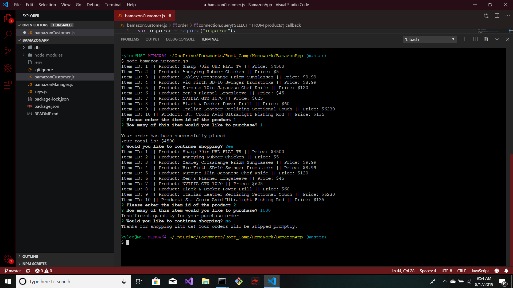

# BamazonApp
An application that mocks the Amazon shopping experience. Users will be able to view a table of items available for purchase. Users will be issued prompts that will guide them through the Bamazon shopping experience. 

When running the application, a table is rendered displaying all of the products and associated properties that are currently in the inventory. The application then prompts the user to enter the item number for the product of interest. Another prompt follows asking the user to enter the number of products that need to be purchased. If the number of items desired is available in stock, the user will receive a message indicating that the order was successful. The user will receive a prompt asking if there are there are other items that need to be purchased. If the user enters an amount that exceeds the current stock for a specific item, the user will receive a message indicating that there is an insufficient quantity to complete the order (as demonstrated in the photo). If the user declines the need to continue shopping, the user will receive a message indicating that the application is being terminated.  
